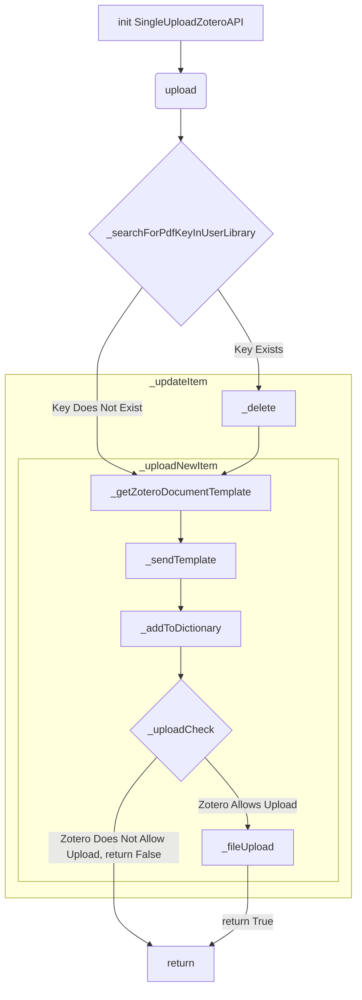

# ZoteroSync
A Python program for users to bulk download files with annotations from Zotero to a local repository and then upload their edits. Features include customizability with a user-specified directory, duplication control, and automatic detection and implementation of uploading new or edited files via a PDFDictionary log to keep track of changes on your local repository compared to Zotero's file repository.

